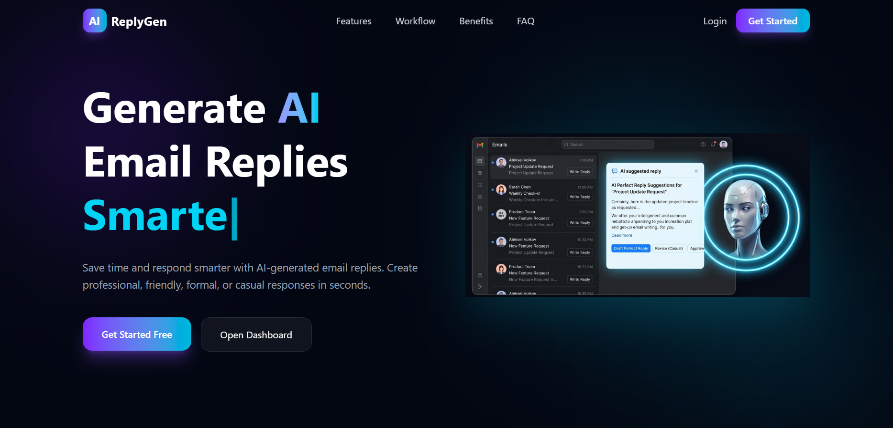
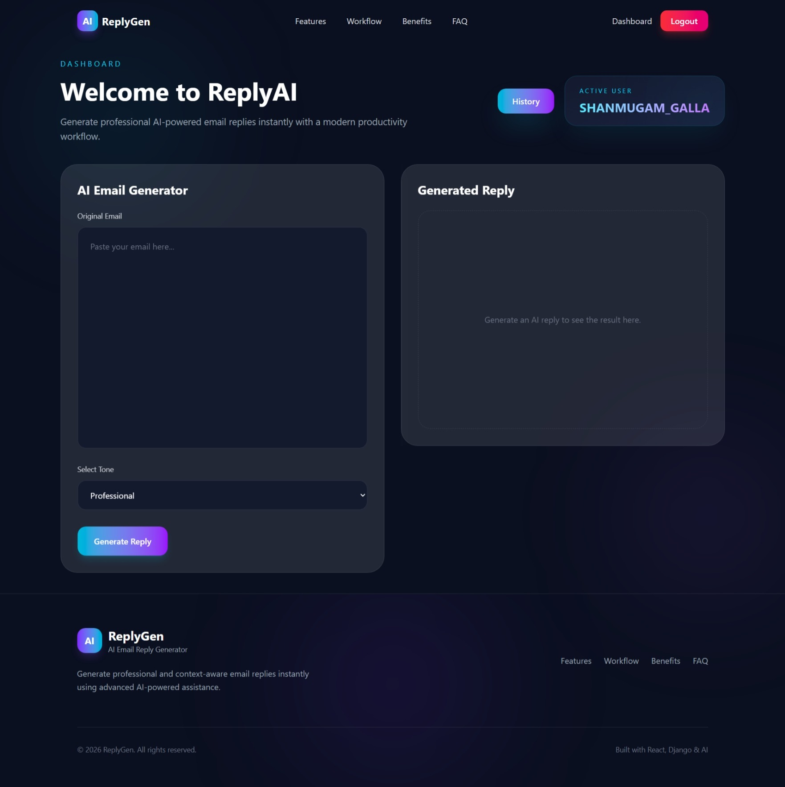
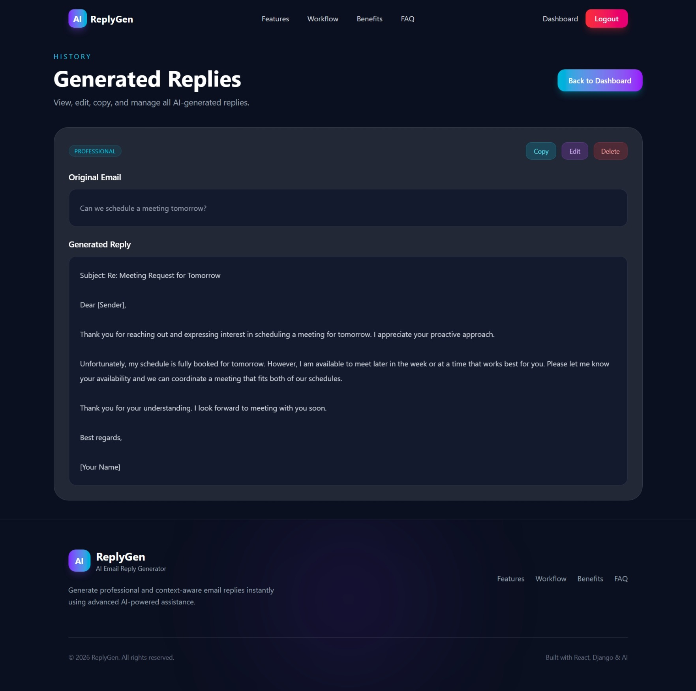

# AI Email Reply Generator

AI Email Reply Generator is a full-stack SaaS-style web application that helps users generate professional AI-powered email replies using OpenRouter AI models. Users can create accounts, generate replies in multiple tones, manage reply history, and reset passwords using security questions.

## Live Demo

### Frontend
https://ai-email-reply-generator-zeta.vercel.app

### Backend API
https://ai-email-reply-generator-1gzs.onrender.com

---
## Screenshots

### Landing Page



### Dashboard



### History Page



---
## Features

### Authentication

* User Registration
* User Login
* JWT Authentication
* Protected Routes
* Secure Logout

### Password Recovery

* Security Question Based Password Reset
* Retrieve Security Question
* Verify Security Answer
* Reset Password

### AI Email Reply Generation

* Generate AI-powered email replies
* Multiple reply tones:

  * Professional
  * Friendly
  * Formal
  * Casual
* OpenRouter API Integration

### Reply History Management

* Save Generated Replies
* View Reply History
* Edit Saved Replies
* Delete Saved Replies
* User-specific Data Protection

### User Interface

* Modern SaaS Landing Page
* Responsive Design
* Dark Premium Theme
* Glassmorphism Effects
* Framer Motion Animations
* Mobile Friendly Layout

---

## Tech Stack

### Frontend

* React.js
* React Router DOM
* Tailwind CSS
* Framer Motion
* Axios

### Backend

* Django
* Django REST Framework
* JWT Authentication

### Database

* SQLite (Development)

### AI Integration

* OpenRouter API

---

## Project Structure

```text
ai-email-reply-generator/
│
├── backend/
│
├── frontend-react/
│
├── .gitignore
│
└── README.md
```

---

## Authentication Flow

### Register

```http
POST /api/auth/register/
```

### Login

```http
POST /api/auth/login/
```

Returns:

```json
{
  "access": "jwt_access_token",
  "refresh": "jwt_refresh_token"
}
```

### Protected APIs

Authenticated requests require:

```http
Authorization: Bearer <access_token>
```

---

## Password Reset Flow

### Get Security Question

```http
POST /api/auth/security-question/
```

Request:

```json
{
  "username": "john"
}
```

Response:

```json
{
  "security_question": "What is your favorite color?"
}
```

### Reset Password

```http
POST /api/auth/reset-password/
```

Request:

```json
{
  "username": "john",
  "security_answer": "blue",
  "new_password": "newpass123"
}
```

Response:

```json
{
  "message": "Password reset successful"
}
```

---

## AI Reply Generation

### Generate Reply

```http
POST /api/email/generate/
```

Example Request:

```json
{
  "email_content": "Can we schedule a meeting tomorrow?",
  "tone": "Professional"
}
```

Example Response:

```json
{
  "reply": "Thank you for your email. I would be happy to schedule a meeting tomorrow..."
}
```

---

## History Management

### Fetch History

```http
GET /api/history/
```

### Edit Reply

```http
PUT /api/history/<id>/
```

### Delete Reply

```http
DELETE /api/history/<id>/
```

---

## Environment Variables

Create a `.env` file and configure:

```env
OPENROUTER_API_KEY=your_openrouter_api_key
DJANGO_SECRET_KEY=your_secret_key
DEBUG=True
```

---

## Local Development Setup

### Backend

```bash
cd backend

python -m venv .venv

source .venv/bin/activate
```

Install dependencies:

```bash
pip install -r requirements.txt
```

Run migrations:

```bash
python manage.py migrate
```

Start server:

```bash
python manage.py runserver
```

---

### Frontend

```bash
cd frontend-react
```

Install dependencies:

```bash
npm install
```

Start development server:

```bash
npm run dev
```

---

## Current Status

### Backend

* JWT Authentication
* Password Reset System
* OpenRouter Integration
* History CRUD
* Standardized API Responses
* Improved Error Handling

### Frontend

* Landing Page
* Login & Registration
* Dashboard
* History Page
* Protected Routes
* Responsive UI

---

## Future Improvements

* Toast Notifications
* Loading States
* Skeleton Loaders
* Token Expiry Handling
* Enhanced Error Handling
* Dashboard Enhancements
* Deployment Optimizations

---

## Author

Shanmugam Galla

AI Email Reply Generator — Full Stack SaaS Project using React, Django, DRF, JWT Authentication, and OpenRouter AI.
